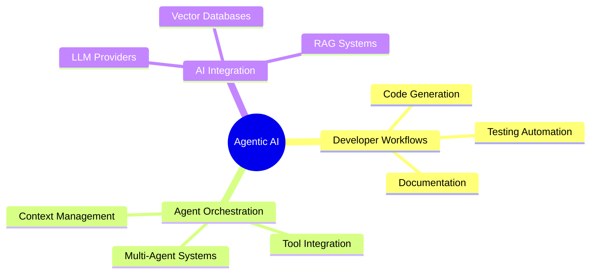

<picture> </picture><h2>About me</h2>
As a builder at heart, my passion lies in architecting and creating complete, intelligent AI systems from the ground up. I don't just focus on a single algorithm or model; I immerse myself in the entire creative process—from the initial spark of an idea to building a reliable, user-friendly application that works in the real world.

My approach is to build for the future. I design systems like a set of independent building blocks, making them easier to manage, update, and fix without the whole structure falling apart. I thrive on the challenge of making AI understand complex information from various sources—like documents, images, and videos—and weaving it all together into a seamless, conversational experience. This often culminates in creating smart, autonomous agents that can perform complex tasks on their own, acting as capable assistants that simplify our digital lives.

This drive for constant improvement is fueled by a relentless work ethic and a constant companion: the invisible monster of Imposter Syndrome. It's a persistent voice that mocks and whispers that there are always others who are far more skilled. But instead of feeling inferior, I've learned to see that voice not as a threat, but as fuel.

It pushes me to forge my own path, to relentlessly hone my skills, and to embrace the journey of taming that monster day by day. This constant pursuit transforms the fear into a force for growth, shaping me into a more resilient and multifaceted developer. Ultimately, I believe that every complex problem is an opportunity for learning, and I am driven by the process of discovering elegant solutions, one challenge at a time.
<picture> </picture>

  

🎯 Current Focus

Agentic AI Integration with Developer Workflows

Building intelligent systems that seamlessly integrate AI agents into development processes, enhancing productivity and automating complex workflows.

Agentic AI Integration with Developer Workflows

Building intelligent systems that seamlessly integrate AI agents into development processes, enhancing productivity and automating complex workflows.

🛠️ Tech Stack & Expertise

<h3>🤖 Machine Learning & Data Science</h3>

<h3>🧠 Deep Learning</h3>

<h3>🤖 LLM Providers & Inference</h3>

<h3>🎨 Generative AI</h3>

<h3>🔗 Protocols & APIs</h3>

<h3>⚡ Backend Technologies</h3>

<h3>🗄️ Database Technologies</h3>

Vector Databases

Graph Databases

SQL Databases

NoSQL Databases

<h3>🤖 Agentic AI Frameworks</h3>

📊 GitHub Analytics

🎯 Current Projects & Focus Areas
code
Mermaid
download
content_copy
expand_less

mindmap
  root((Agentic AI))
    Developer Workflows
      Code Generation
      Testing Automation
      Documentation
    Agent Orchestration
      Multi-Agent Systems
      Tool Integration
      Context Management
    AI Integration
      LLM Providers
      Vector Databases
      RAG Systems

🔥 What I'm Working On:

🤖 Intelligent Code Assistants - Building AI agents that understand and enhance developer workflows

🔄 Multi-Agent Systems - Creating collaborative AI systems for complex problem-solving

📚 RAG Applications - Developing retrieval-augmented generation systems for enterprise knowledge management

🛠️ Developer Tools - Creating tools that integrate AI seamlessly into development processes

🤝 Let's Collaborate!
💡 Open to collaborating on:

Full Stack & Gen AI Projects

Agentic AI Systems

Developer Tool Integration

AI-Powered Applications

📫 Connect With Me

⚡ Fun Fact

🧩 I have a knack for solving complex challenging problems

"Every complex problem is just a series of simple solutions waiting to be discovered"

🙏 Thanks for visiting my profile!

<i>⭐ From <a href="https://github.com/raghunandarukulla">raghunandarukulla</a> with ❤️</i>

