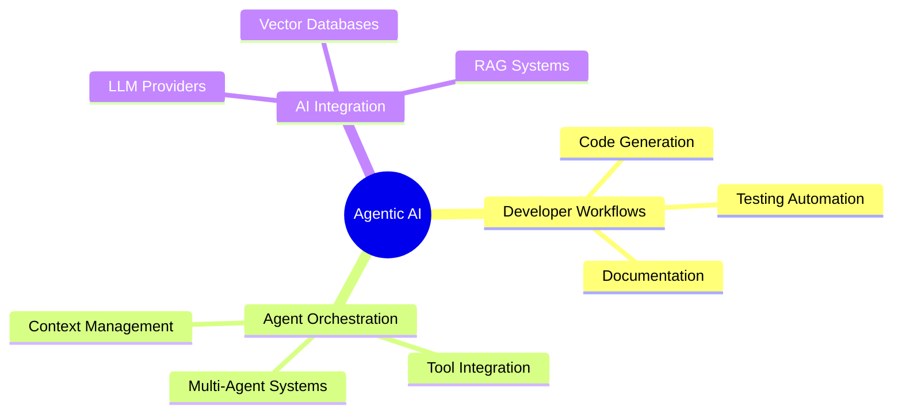

<picture> </picture>

<picture> </picture><h2>About me</h2>
I'm driven by a relentless work ethic, constantly pushing to improve despite battling imposter syndrome. Rather than letting self-doubt hold me back, I channel it as fuel for growth, using it to forge my own path and continuously hone my skills. I see every complex problem as a learning opportunity and am motivated by discovering elegant solutions to challenging technical puzzles.

<picture> </picture>

# Tech Stack & Expertise

## Machine Learning & Data Science</h3>

<picture> </picture>
##  Deep Learning 

 

## LLM Providers 

 

## Embedding Models 

 

 

## Development Tools , IDE or ADE (Agent Development Environment)  

## AI  Protocols 

## Frontend </h3> 

 ## Backend Technologies

## Database Technologies

### Vector Databases

  
 

### Graph Databases

### SQL Databases

### NoSQL Databases

## Containerization 

## Deployment providers  

## Agentic AI Frameworks 

## GitHub Analytics

## Current Projects & Focus Areas

## 🤝 Let's Collaborate!
💡 Open to collaborating on:

1. Full Stack & Gen AI Projects
2. Agentic AI Systems
3. Developer Tool Integrations
4. AI-Powered Applications

📫 Connect With Me

 

🙏 Thanks for visiting my profile!

